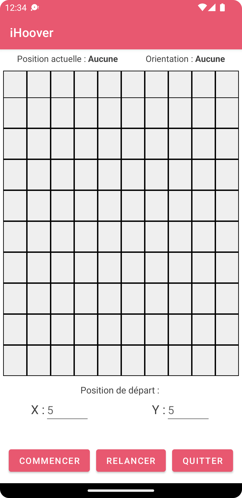

**iHoover**

 

Pour ce projet, j'ai fait le choix du langage `(Java)` en développant une application mobile sous `(Android Studio)`.

L'application répond à toutes les contraintes énoncées dans la description du projet, en voici quelques captures d'écran :

| | | |
| :------: | :------: | :------: |
|  |  |  |

Pour télécharger l'application, [cliquez ici](app/release/iHover.apk).